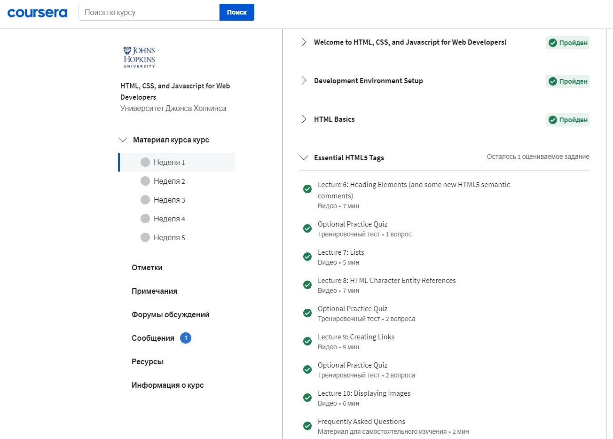
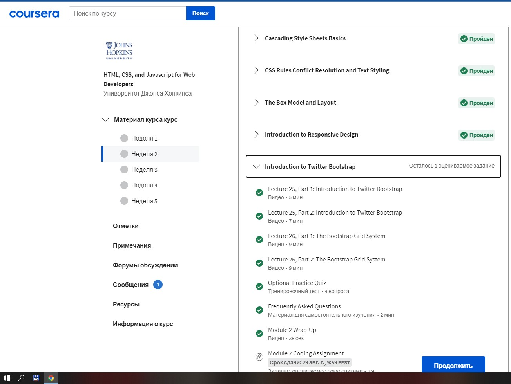
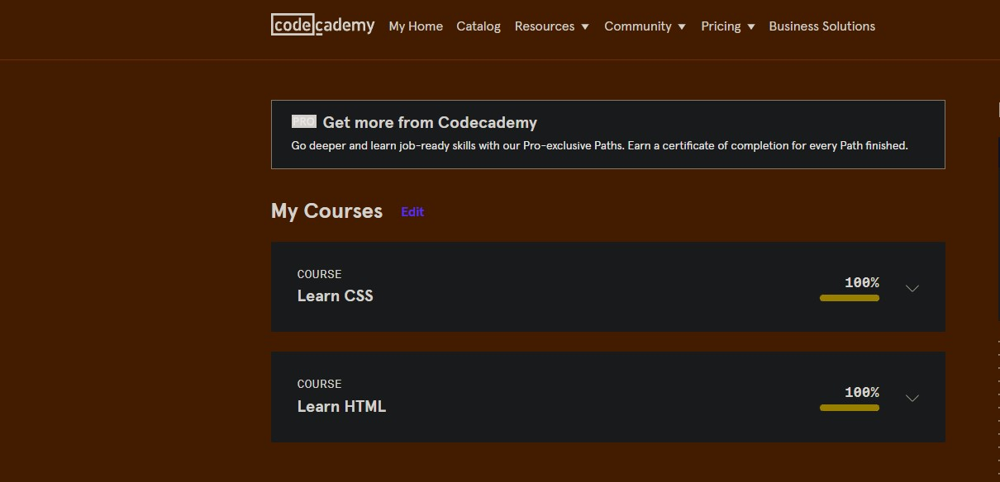
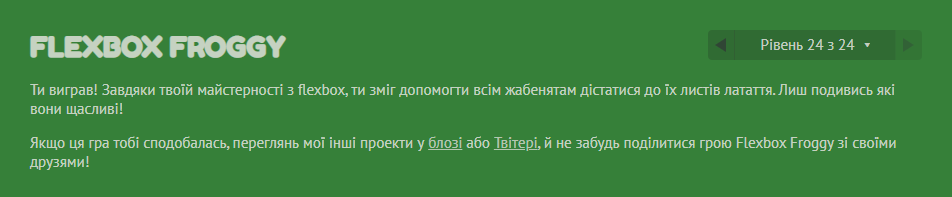
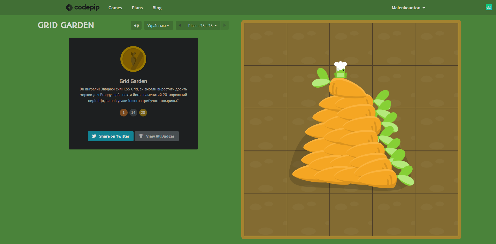

# Hello Kottans! I`m Anton from Krivoy Rog city
***Thank you for this opportunity to learn!***
## Git and GitHub

ABOUT MY IMPRESSIONS IN DETAIL

### First step:
> **Coursera** https://www.coursera.org/learn/introduction-git-github
I studied the materials of the Coursera course.
It was an interesting experience due to the lab works.

SEE THE SCREENSHOT

---
### Second step:
> **Learn Git Branching** https://learngitbranching.js.org/

SEE THE SCREENSHOT

I also highlighted the interesting things about  `git fetch/pull/push origin source:destination`

## Linux CLI, and HTTP

SEE THE SCREENSHOTS

## Git Collaboration

SEE THE SCREENSHOTS

## Intro to HTML and CSS

SEE THE SCREENSHOTS

## Responsive Web Design

SEE THE SCREENSHOTS

## HTML and CSS practice

SEE THE PRACTICE

[Demo](https://malenkoak.github.io/Popup/)
[Code basic](https://github.com/MalenkoAK/kottan-frontend/blob/main/Popup/index.html)